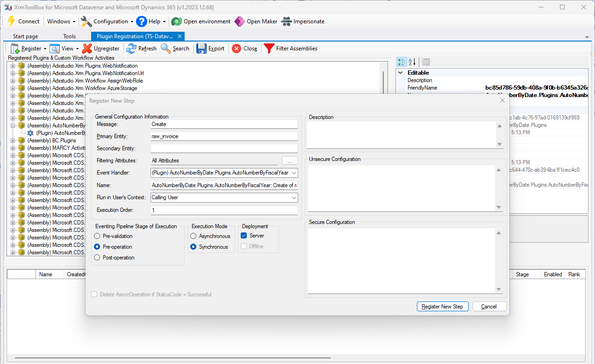
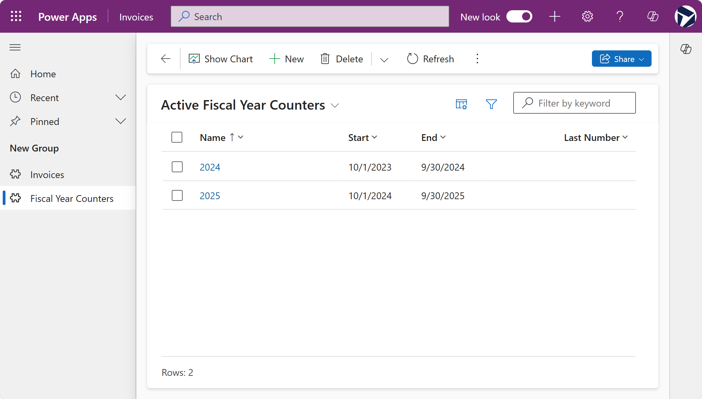
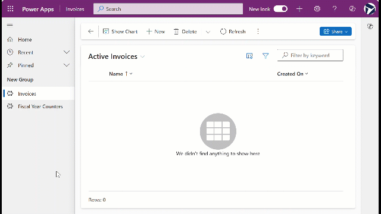

In many scenarios, businesses require custom auto-numbering for records in Microsoft Dataverse that go beyond the default functionality provided. In this article, I’ll walk you through a solution that involves creating a custom auto-number field without using the out-of-the-box auto-numbering feature in Dataverse. Instead, we'll use a combination of a custom entity as a counter and a plugin that triggers on the pre-create event of the target table.

## The Approach

For this solution, we’ll create a custom table called **Fiscal Year Counter**. This table will manage our numbering sequence based on the fiscal year. The idea is to dynamically generate invoice numbers that reset each fiscal year, providing a high level of customization to fit your organization’s unique fiscal calendar.

### The **Fiscal Year Counter** Table Setup

First, create a table named **Fiscal Year Counter** with the following fields:

- **Name** (String): To store the fiscal year name, such as "FY2024."
- **Start Date** (Date Only, Time zone independent): The start date of the fiscal year.
- **End Date** (Date Only, Time zone independent): The end date of the fiscal year.
- **Last Number** (Whole Number): To track the last generated number for the fiscal year.

This setup allows you to configure fiscal years according to your organization’s requirements. The records in this table must be pre-created with appropriate Name, Start Date, and End Date values. If you want to start the numbering at a value other than 1, you can set the **Last Number** field accordingly.

> **Important:** Ensure that the **Start Date** and **End Date** fields are set to "Date Only" and "Time Zone Independent." This is crucial for the logic to work correctly, as using other date/time formats may lead to discrepancies in determining the correct fiscal year during the auto-numbering process.

## Implementing the Auto-Numbering Logic

To automate the numbering, I developed a plugin that runs on the `pre-create` event of the target table, which in this example is **Invoices**. This plugin increments the last number in the **Fiscal Year Counter** table based on the current fiscal year and assigns the new number to the invoice.



### Using the Record Creation Date to Determine the Fiscal Year

The plugin determines which fiscal year a record belongs to by using the date on which the record is created. It compares this date with the start and end dates defined in the **Fiscal Year Counter** table to identify the correct fiscal year.

### Ensuring Uniqueness Through Database Locks

A crucial part of the plugin’s design is ensuring that each auto-generated number is unique. To achieve this, the plugin locks the **Fiscal Year Counter** record during the number generation process. This lock prevents other processes from accessing the same record simultaneously, which could otherwise result in duplicate numbers.

This locking mechanism is critical to maintaining the integrity of the auto-numbering sequence. Therefore, it's important not to refactor the code for the sake of efficiency, as the current design prioritizes accuracy and uniqueness over speed.

### Steps in the Auto-Numbering Process

Here's a high-level overview of the steps involved:

1. **Identify the Fiscal Year**: When a new invoice is created, the plugin uses the current date to determine which fiscal year the record falls into by comparing it against the start and end dates in the **Fiscal Year Counter** table.

2. **Lock the Fiscal Year Record**: The plugin locks the identified fiscal year record to ensure no other process can modify it simultaneously, preventing duplicate numbers.

3. **Increment the Last Number**: The plugin retrieves the **Last Number** field for the identified fiscal year, increments it, and updates the field.

4. **Assign the Auto-Number**: The plugin concatenates the fiscal year name (e.g., "FY2024") with the incremented number and assigns it to the invoice.

## Writing the Plugin

To implement this, you need to write a plugin that follows the steps outlined above. I won’t go into the details of settings up a plugin project, but I highly recommend referring to [this guide on writing plugins](https://learn.microsoft.com/en-us/power-apps/developer/data-platform/write-plug-in?tabs=pluginbase) if you need help getting started. This guide provides a comprehensive tutorial on creating and registering a plugin in Dataverse.

```c#
using Microsoft.Xrm.Sdk;
using Microsoft.Xrm.Sdk.Messages;
using Microsoft.Xrm.Sdk.Query;
using System;
using System.Linq;
using System.ServiceModel;

namespace AutoNumberByDate.Plugins
{
    public class AutoNumberByFiscalYear : IPlugin
    {
        public void Execute(IServiceProvider serviceProvider)
        {
            // Obtain the tracing service
            ITracingService tracingService =
            (ITracingService)serviceProvider.GetService(typeof(ITracingService));

            // Obtain the execution context from the service provider.  
            IPluginExecutionContext context = (IPluginExecutionContext)
                serviceProvider.GetService(typeof(IPluginExecutionContext));


            // The InputParameters collection contains all the data passed in the message request.  
            if (context.InputParameters.Contains("Target") &&
                context.InputParameters["Target"] is Entity)
            {
                // Obtain the target entity from the input parameters.  
                Entity entity = (Entity)context.InputParameters["Target"];

                // Obtain the IOrganizationService instance which you will need for web service calls.  
                IOrganizationServiceFactory serviceFactory =
                    (IOrganizationServiceFactory)serviceProvider.GetService(typeof(IOrganizationServiceFactory));
                // Passing null into CreateOrganizationService will get the system organization service which will have access to the fiscal year counter by default.
                IOrganizationService service = serviceFactory.CreateOrganizationService(null);

                try
                {
                    //call the method to set the name field with the fiscal year number
                    SetNameFieldWithFiscalYearNumber(entity, service);
                }

                catch (FaultException<OrganizationServiceFault> ex)
                {
                    throw new InvalidPluginExecutionException("An error occurred in AutoNumberByFiscalYear.", ex);
                }

                catch (Exception ex)
                {
                    tracingService.Trace("AutoNumberByFiscalYear: {0}", ex.ToString());
                    throw;
                }
            }
        }

        private static void SetNameFieldWithFiscalYearNumber(Entity entity, IOrganizationService service)
        {
            string controlNumber = "0001";
            int currentNumber = 1;
            // Get the current date in UTC.
            DateTime currentDate = DateTime.UtcNow.Date;

            // Look for an existing fiscal year counter entity
            QueryExpression qExpression = new QueryExpression()
            {
                EntityName = "raw_fiscalyearcounter",
                ColumnSet = new ColumnSet("raw_name", "raw_lastnumber"),
                Criteria = new FilterExpression
                {
                    Conditions =
                    {
                        new ConditionExpression("raw_start", ConditionOperator.LessEqual, currentDate),
                        new ConditionExpression("raw_end", ConditionOperator.GreaterEqual, currentDate)
                    }
                }
            };
            EntityCollection results = service.RetrieveMultiple(qExpression);
            Entity counter = results.Entities.FirstOrDefault();

            if (counter != null)
            {
                // If the counter is there update it to lock it in the transaction.
                Entity blocker = new Entity() { LogicalName = "raw_fiscalyearcounter", Id = counter.Id };
                blocker["raw_name"] = counter.GetAttributeValue<string>("raw_name");
                service.Update(blocker);

                // Now that the counter is locked retrieve the counter again so that we can get the current number and update it.
                QueryExpression qExpression2 = new QueryExpression()
                {
                    EntityName = "raw_fiscalyearcounter",
                    ColumnSet = new ColumnSet("raw_lastnumber", "raw_name"),
                    Criteria = new FilterExpression
                    {
                        Conditions =
                        {
                            new ConditionExpression("raw_start", ConditionOperator.LessEqual, currentDate),
                            new ConditionExpression("raw_end", ConditionOperator.GreaterEqual, currentDate)
                        }
                    }
                };

                // DO NOT refactor RetrieveMultipleRequest to RetrieveMultiple otherwise some caching will occur.
                RetrieveMultipleRequest rmRequest = new RetrieveMultipleRequest() { Query = qExpression2 };
                RetrieveMultipleResponse lockedResults = (RetrieveMultipleResponse)service.Execute(rmRequest);
                Entity lockedCounter = lockedResults.EntityCollection.Entities.First();

                Entity counterUpdater = new Entity() { LogicalName = "raw_fiscalyearcounter", Id = counter.Id };

                // Get the current number and increment it.
                currentNumber = lockedCounter.GetAttributeValue<int>("raw_lastnumber");
                currentNumber = ++currentNumber;
                controlNumber = (currentNumber).ToString().PadLeft(4, '0');

                // Update the counter with the new number.
                counterUpdater["raw_lastnumber"] = currentNumber;
                service.Update(counterUpdater);

                // Set the control number on the invoice {FY}{Sequence #}".
                entity["raw_name"] = $"{lockedCounter.GetAttributeValue<string>("raw_name")}{controlNumber}";
            }
            else
            {
                //if no counter was found throw an error
                throw new InvalidPluginExecutionException("No counter was found for the current fiscal year. Please contact your system administrator.");
            }
        }
    }
}
```

You can access the complete code solution I created you can get it here: [https://github.com/rwilson504/DataverseAutoNumberByDateIncrements/tree/main/code/AutoNumberByDate](https://github.com/rwilson504/DataverseAutoNumberByDateIncrements/tree/main/code/AutoNumberByDate).

## Example Solution

To help you get started, I’ve created a sample solution that implements the concepts discussed in this article. This example includes the **Fiscal Year Counter** table, the plugin code, and the necessary configurations to replicate the auto-numbering functionality.

Additionally, I’ve included a sample table called **Invoices**, along with a model-driven app that integrates these tables. This setup allows you to easily configure and test the auto-numbering functionality in a practical environment.

You can download the sample solutions here:

- [Unmanaged](https://github.com/rwilson504/DataverseAutoNumberByDateIncrements/raw/main/AutoNumberingBasedonDates_1_0_0_1.zip)
- [Managed](https://github.com/rwilson504/DataverseAutoNumberByDateIncrements/raw/main/AutoNumberingBasedonDates_1_0_0_1_managed.zip)

### Creating the Fiscal Year Counter Records

Below are screenshots showing the setup of the **Fiscal Year Counter** records. These screenshots demonstrate how to configure the Name, Start Date, End Date, and Last Number fields.



### Creating New Invoices

Here are screenshots showing the process of creating new invoices with the custom auto-numbering system in place. You’ll see how the plugin automatically assigns a unique invoice number based on the current fiscal year using the record creation date.



## Conclusion

By following this approach, you can create a highly configurable auto-numbering system that adapts to your organization’s fiscal year requirements while ensuring the uniqueness of each generated number. This method not only offers flexibility but also integrates seamlessly with Dataverse, allowing for custom logic and automation that out-of-the-box features may not provide.
